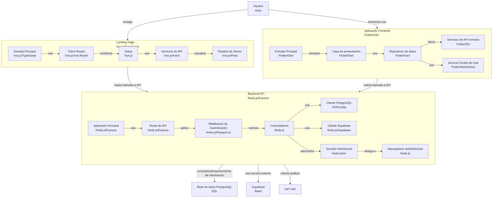

# 📂 ArchivaCore


**ArchivaCore** es una aplicación para la gestión eficiente de archivos en entornos corporativos. Su propósito es **centralizar, organizar y resguardar información** de manera segura, con acceso ágil y controlado.  

Incluye un módulo de **inteligencia artificial (GPT)** para el análisis automatizado de hojas de vida, optimizando la gestión del talento en **Recursos Humanos**.  

---

## 🛠️ Tecnologías principales

- **Frontend Web:** Vue 3 + TypeScript + Vite + Pinia  
- **Frontend Escritorio:** Flutter + Dart  
- **Backend:** Node.js + Express + WebSocket  
- **Base de datos:** PostgreSQL  
- **Almacenamiento:** Supabase Storage  
- **IA:** API GPT  

---

## 🔎 Arquitectura



📌 *El frontend nunca accede directamente a la base de datos ni a Supabase, siempre lo hace a través del backend.*  

---

## 📂 Estructura del Proyecto

```
database/   -> Tablas, funciones, triggers y seeds
backend/    -> API REST, controladores, modelos, rutas y lógica de negocio
frontend/   -> Aplicación de escritorio (Flutter)
landing/    -> Web app (Vue 3 + TypeScript + Pinia + Vite)
```

---

## ⚙️ Requisitos

- Node.js **18+**  
- PostgreSQL **13+**  
- Flutter **3.29+**  
- Cuenta de Supabase  
- npm o Yarn  

---

## 🔑 Variables de Entorno

Crea un archivo `.env` en `backend/` y `landing/` a partir de los `.env.example`.  
Variables más importantes:  

```ini
PORT=3000
DB_USER=usuario
DB_PASSWORD=contraseña
DB_HOST=localhost
DB_NAME=archivacore
DB_PORT=5432
SECRET_KEY=clave_secreta
EXPIRE_TOKEN=1d
SUPABASE_URL=https://xxxx.supabase.co
SUPABASE_API_KEY=xxxx
GPT_API_KEY=xxxx
```

---

## 🚀 Instalación

### Backend
```bash
cd backend
npm install
npm run dev
```

### Frontend Web (Vue 3)
```bash
cd landing
npm install
npm run dev
```

### Frontend Escritorio (Flutter)
```bash
cd frontend
flutter pub get
flutter run -d windows
```
**Opcional:** Si hay clases anotadas con @freezed se debe ejecutar el siguiente comando:
```bash
cd frontend
flutter run build_runner build --delete-conflicting-outputs
```

### Base de datos
Ejecutar en orden:  
1. `ddl.sql`  
2. `functions.sql`  
3. `triggers.sql`  
4. `seeds.sql`  

---

## 🔐 Seguridad

- **Autenticación:** JWT + Passport  
- **Roles y permisos:** gestionados en DB  
- **Contraseñas:** encriptadas con bcrypt  

---

## 👥 Equipo

Desarrollado por:  
- Leonardo Echeverry  
- Iván Casallas  
- Eva Fajardo  
- Sebastián Sánchez  
